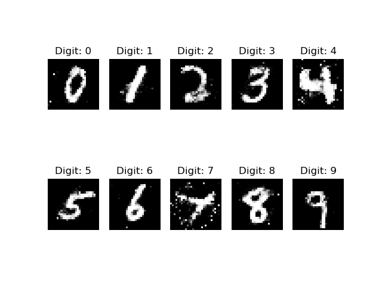

# Conditional_GAN_Mnist
# Abstract 
This project is our team's final project for the course CS492 "Machine learning Computer vision" at Kaist University.
Inside this project, we implement conditional GAN model for the Mnist dataset.

# Installation
- keras==2.4.3
- tensorflow==2.4.0

# Train 
To train, just run the file cgan.py .

After a certain number of epochs during the training process, weight of model would be saved to folder "saved_model_weights" 
and images generated by model would be saved to folder "images".

After the training completed, the plot for training history would be saved to folder "plot_history_training".

# Test
For demo, i have trained model once and uploaded the generated images as well as model weight into two folders 
"images/version1" and "saved_model_weights/version1". To test the performance of the trained model, please
run the file test_cgan.py .

Images of digits generated by our model after training for 100000 epochs:

# Extend 
During implementing this project, we get some problems such as "mode collapse" and "convergence failure". 

In this project, the file cgan_mode_collapse.py contains code for the model that produces "mode collapse" problem.

And the file cgan_convergence_failure.py contains code for the model that produces "convergence failure" problem.

Furthermore, after we get a good model (in file cgan.py), we try to improve our model by applying the technique
"label smoothing". The file cgan_one_sided_smoothing.py contains code for the model that applies this technique. 

# Experiment result
We create a report for problems during training such as "mode collapse" and "convergence failure", as well as 
how to overcome them

We also report the effect of applying "one sided label smoothing" technique to our model. 

You can find this report in section II(Conditional GAN) inside the file CW2_Computer_Vision_Kaist.pdf that i have uploaded in this project.
